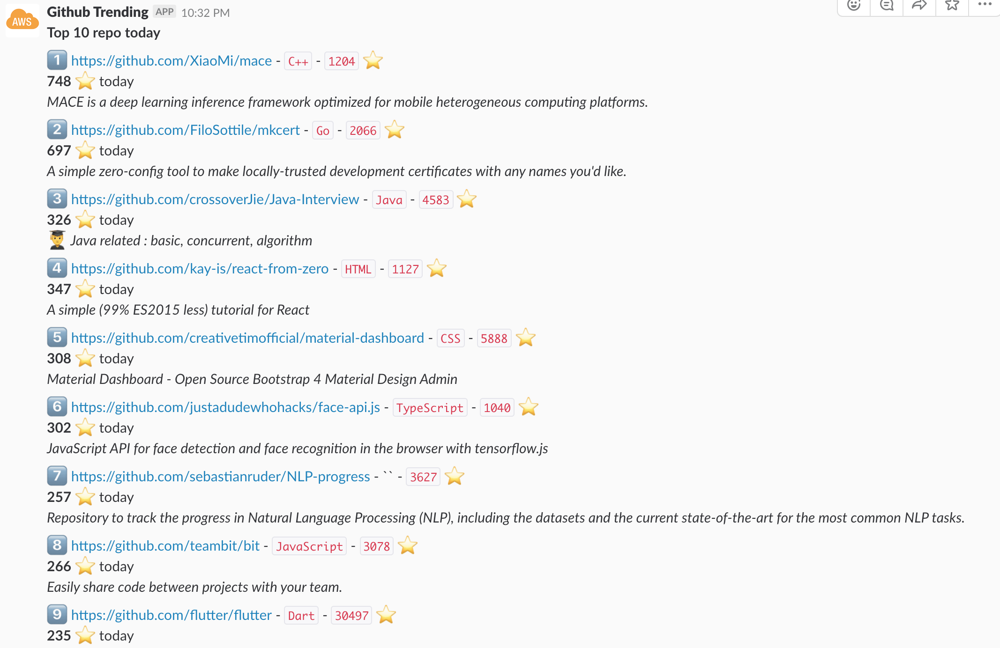

# trending-slack-bot

Cron to post top 10 trending github repos today using lambda 

## Usage

1. Write Lambda function `main.go`
1. Install dependencies
    ```
     go get github.com/aws/aws-lambda-go
     go get github.com/dangkaka/go-trending
    ```
1. Build binary file and zip it in `deployment.zip`
    ```
    make release
    ```
1. Deploy the function to Lambda:
Using [terraform](https://www.terraform.io/)
* Edit `terraform.tfvars` with your corresponding values
    ```
    aws_profile = "money"
    slack_webhook = "https://hooks.slack.com/services/TOKEN"
    schedule = "cron(0 8 ? * MON-FRI *)"
    ```
    * `aws_profile` is account in `~/.aws/credentials` 
    * [schedule](https://docs.aws.amazon.com/lambda/latest/dg/tutorial-scheduled-events-schedule-expressions.html). Note: using UTC time
* Apply
    ```
    terraform init
    terraform apply
    ```
## Result


